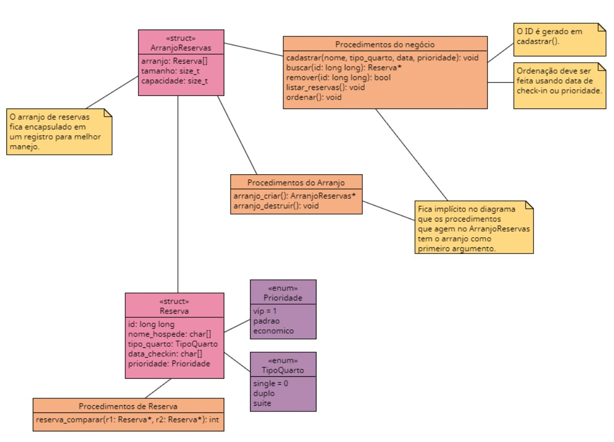

# Gerenciamento de Reservas
Um sistema em C de gerenciamento básico de reservas de um hipotético hotel.
## Arquitetura do projeto

## O que precisa ser feito:
- [x] criar a `struct` *Reserva*;
- [x] criar a `struct` *ArranjoReservas*;
- [x] criar as `enum` *TipoQuarto* e *Prioridade*;
- [x] implementar o procedimento `reserva_comparar()`;
- [x] implementar os procedimentos do *ArranjoReservas*; e
- [x] implementar os procedimentos do negócio.
- [ ] implementar a interface de comando com o usuário.
- [ ] modificar o ordenamento, em vez de id, ordenar por prioridade ou data. E usar o procedimento comparar_reservas() para isso.
