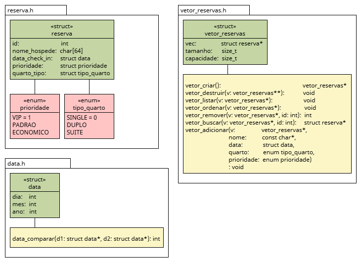

# Gerenciamento de Reservas
Um sistema em C de gerenciamento básico de reservas de um hipotético hotel.
## Arquitetura do projeto

## O que precisa ser feito:
- [ ] refatoração do projeto
- [ ] implementação dos testes
